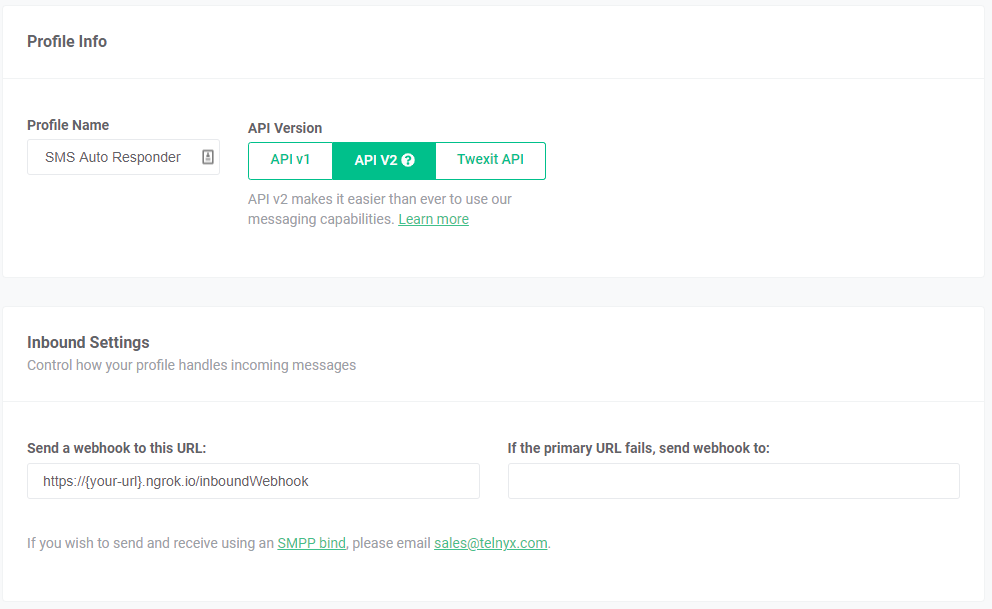

# SMS Auto Responder
A simple node application demonstrating the ability to send and receive SMS messages using the Telnyx Messaging API

## Pre-requisites
* a [Telnyx Account](https://telnyx.com/sign-up)
* a [Telnyx Phone Number](https://portal.telnyx.com/#/app/numbers/my-numbers)
* [ngrok](https://ngrok.com/) or a similar service that allows you to tunnel public webhook requests to your local development environment
* [node.js and npm](https://nodejs.org/en/)

## Setup
### Step 1 - Cloning the repo and installing dependencies
Run the following commands to get started
```
$ git clone https://github.com/jsevilla274/sms-auto-responder.git
$ cd sms-auto-responder
$ npm install
```
### Step 2 - .env
This application uses [dotenv](https://github.com/motdotla/dotenv) package to manage environment variables. Make a copy of [`.env.sample`](./.env.sample), save it as `.env`, and update the variables to match your credentials.
| Variable               | Description                                                                                                                                              |
|:-----------------------|:---------------------------------------------------------------------------------------------------------------------------------------------------------|
| `TELNYX_API_KEY`       | Your [Telnyx API Key](https://portal.telnyx.com/#/app/api-keys)              |
| `TELNYX_PUBLIC_KEY`    | Your [Telnyx Public Key](https://portal.telnyx.com/#/app/account/public-key) |
| `TELNYX_APP_PORT`      | **Defaults to `8080`** The port the app will be served                           

### Step 3 - ngrok
For Telnyx to access access the application's webhook endpoints (or controllers), we must use a tunneling service like ngrok to have a publicly accessible url. Launch ngrok using the `TELNYX_APP_PORT` defined in your `.env` file

```
./ngrok http 8080
```

Your Terminal should look _something_ like

```
ngrok by @inconshreveable                                                                                                                               (Ctrl+C to quit)

Session Status                online
Account                       Little Bobby Tables (Plan: Free)
Version                       2.3.35
Region                        United States (us)
Web Interface                 http://127.0.0.1:4040
Forwarding                    http://your-url.ngrok.io -> http://localhost:8000
Forwarding                    https://your-url.ngrok.io -> http://localhost:8000

Connections                   ttl     opn     rt1     rt5     p50     p90
                              0       0       0.00    0.00    0.00    0.00
```

Take note of the application url `https://{your-url}.ngrok.io`, as in will be used in the next step.
### Step 4 - Setting up a messaging profile
Assuming you have a [Telnyx account](https://telnyx.com/sign-up) and have set up [a number](https://portal.telnyx.com/#/app/numbers/my-numbers), access the [Messaging Portal](https://portal.telnyx.com/#/app/messaging) and "Add new profile". You should be taken to a page that looks as follows:



Give the profile a name in the **Profile Name** field. This example uses the name "SMS Auto Responder". 

Then, enter the application url from the previous step in the **Send a webhook to this url** field, adding `/inboundWebhook` to the end of it. This is done because the application receives inbound SMS webhooks through this endpoint, as defined in [index.js](index.js). The complete url should look something like `https://{your-url}.ngrok.io/inboundWebhook` if you are using ngrok.

Finally, navigate to the [Numbers Portal](https://portal.telnyx.com/#/app/numbers/my-numbers) and assign the previously created messaging profile to your Telnyx number.


This example attaches the "SMS Auto Responder" messaging profile to the number +1-800-000-0000.

## Running
After setting up, navigate to the project root and run the application
```
$ node index.js
```
Once the server starts, you should be able to send a text message to the Telnyx number associated with the messaging profile and get a response. Pay close attention to the replies, as different messages return different replies!

## Credits
* team-telnyx's [express-messaging](https://github.com/team-telnyx/demo-node-telnyx/tree/master/express-messaging) repo for code snippets in index.js and for the basis of this README
* Telnyx's SMS [Sending](https://developers.telnyx.com/docs/v2/messaging/quickstarts/sending-sms-and-mms?lang=node) and [Receiving](https://developers.telnyx.com/docs/v2/messaging/quickstarts/receiving-sms-and-mms?lang=node) documentation pages